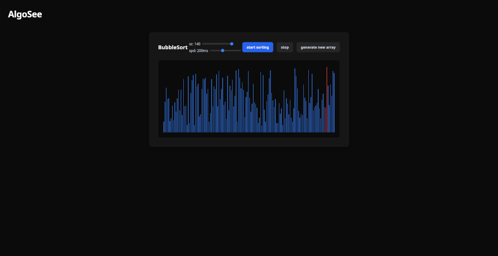
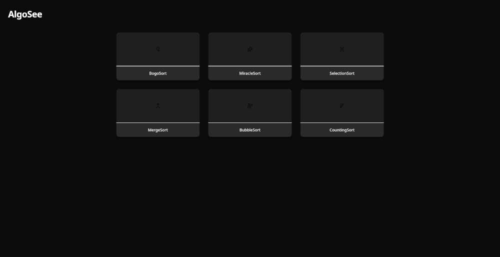

# algosee © 2026 MrHunor, siryanni (as equals) GPLv3

# A 0815 Algorithm Visulizer.

    

## Features:
- **Choose between 6 sorting algorithms**
- **View an overview of the algorithm inclduing summary, time complexity and space complexity**
- **Simulate sorting an array from sizes 3 to 140 in varying speeds with single swap animations**
- **Make curl requests to the server yourself**

## Supported Algorithms:
- Selection sort
- Bogo sort 
- Bubble sort
- Quick sort
- Merge sort
- Counting sort

## Test it out yourself!
Click [here](https://mrhunor.github.io/algosee) to test if out yourself!
To test the backend via a curl command [go here](#to-test-the-backend-online-linux)

## Tech Stack:
- **Frontend:** HTML,CSS,JS
- **Backend:** C++
- **Building:** CMAKE, GCC
- **Package Managment:** conan
- **Hosting:** Github Pages (Frontend), Render (Backend) 

## Plans: 
Current plans invlove expanding into other areas of algorithms, like wayfinding algorithms.

## Workflow:
1. Currently a visitor on https://mrhunor.github.io/algosee is shown the newest version of the fronend (./frontend).
2. Via clicking on any algorithm they are sending a status request to the backend server (algosee.onrender.com), depending on its outcome the frontend displays a loading screen in the time of the server waking up.
3. By pressing the "start" button on the viszulizer.html they are sending a html POST request [like this](#to-test-the-backend-online-linux) to the backend.
4. The backend extracts the algorithm Name from the URL and performs the sorting.
5. The backend return the sorted array, a set of instructions on how to visulise the sorting and metadata like backend version and time in nanoseconds.
6. The frontend visulises the instructions returned by the backend.   

 
 
 
 
 
 
   

# ----------------For Contributers-------------------------- 

## Project structure:
- `./assets` Contains images for this ReadME
- `./benchmarks` Contains the benchmark script and results
- `./frontend` Root folder of the Frontend side  
   -> `/assets/` Contains the images seen in the index.html  
   -> `/css/` contains the main css file  
   -> `/js/` Contains JS files  
   -> `/` Contains all html files  
- `./src` Root folder of the Backend side  
   -> `/server/` Contains server logic  
   -> `/sortalgo/` Contains sort algorithms   
   -> `/utils/` Contains usefull tools  
   -> `/` Contains main.cpp
- `/` Contains all files needed for building the executable as well as this readME and the LICENSE file

## To build the Project:  
**DISCLAIMER: Technically, this project could build on windows but it has not been tested. The compilation has been verified on Linux Mint and CachyOS.**  
0. `cmake --version` >= **4.4.3**  
   `gcc --version` >= **16.2.1 20260810**  
   `conan --version` >= **2.32.0**
1. `conan install . --output-folder=build --build=missing` to install dependencies  
2. `cmake --preset conan-release` to automaticall configure the build with conan dependencies (-> **if this fails** and you have to rerun the command you HAVE to delete the build Folder and restart from scratch because cmakeCache has already been written)  
3. `cmake --build build` to build 

## To test the backend sorting locally (linux):
Use curl to make a request while the server is running, e.g.: `curl -v -X POST "http://127.0.0.1:8080/sortalgo?algo=selection" -H "Content-Type: application/json" -d "{\"values\":[$(seq 1 n | shuf | paste -sd, -)]}" ` where n = number of values (be careful of the actual port when running through docker)  

## To test the backend sorting online (linux):
Use curl to make a request to the render server, e.g.: `curl -v -X POST "https://algosee.onrender.com/sortalgo?algo=quick" -H "Content-Type: application/json" -d "{\"values\":[$(seq 1 n | shuf | paste -sd, -)]}"` where n = number of values (be careful of the actual port when running through docker)

## To test the beckend pathfinding locally (linux):
Use curl to make a request while the server is runningm e.g.:`curl -X POST "https://127.0.0.1:8080/pathalgo?algo=BFS" -H "Content-Type: application/json" -d '{"MAP": [[false, false, true,  false],[true,  false, true,  false],[false, false, false, false],[false, true,  true,  false]],"START": [0, 0],"end":   [3, 3]}'`

## To test the backend pathfinding online(linux):
Use curl to make request to the render server, e.g.: `curl -X POST "https://algosee.onrender.com/pathalgo?algo=BFS" -H "Content-Type: application/json" -d '{"MAP": [[false, false, true,  false],[true,  false, true,  false],[false, false, false, false],[false, true,  true,  false]],"START": [0, 0],"end":   [3, 3]}'`

 

# Big :heart: to the following:
- [Render](https://render.com/), for their free tier hosting which the online Backend relies on.