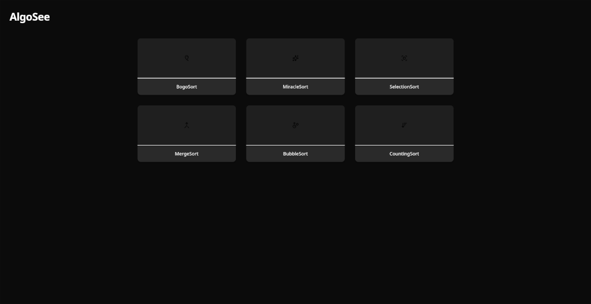
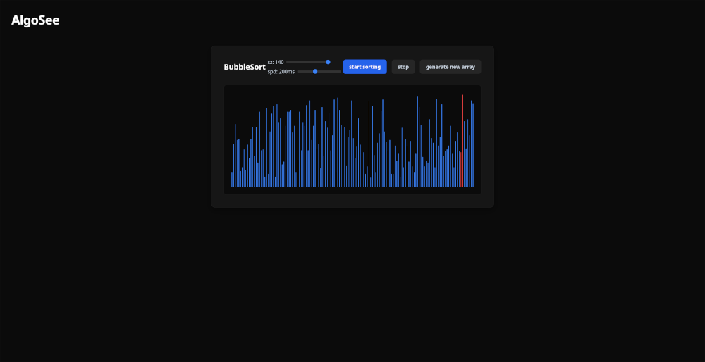

# algosee

**A 0815 Algorithm Visulizer**

*© 2026 MrHunor, siryanni (as equals) · GPLv3*

## Demo:
    

## Features:
- **Choose between 7 sorting or 4 Pathfinding algorithms**
- **View an overview of the algorithm inclduing summary, time complexity and space complexity**
- **Simulate sorting an array from sizes 3 to 140 in varying speeds with single swap animations**
- **Simulate pathfinding in a 25x15 Map with diffrent tiles**
- **Listen to the satisfying sound of a sorting algorithm**
- **Make curl requests to the server yourself**

## Test it out yourself!
Click [here](https://mrhunor.github.io/algosee) to test if out yourself!
To test the backend via a curl command [go here](#to-test-the-backend-online-linux).

## Algorithms
The implementation will roughly follow the order given in the table.  

### Sorting

| Algorithm | Status |
|-----------|--------|
| Selection | Supported |
| Bogo      | Supported |
| Bubble    | Supported |
| Quick     | Supported |
| Merge     | Supported |
| Counting  | Supported | 
| Cycle Sort | Supported |
| Radix Sort | TBD |
| Intro Sort | TBD |  

-> More ideas? Suggest them [here](https://github.com/MrHunor/algosee/issues)

### Pathfinding 

| Algorithm | Status |
|-----------|--------|
| Breadth first search (BFS) | Supported |
| Dijkstra | Supported |
| Depth first search (DFS) | Supported |
| Bidirectional Breadth first search (BIBFS) | Supported |
| A* | TBD | 
| Greedy Best-First-Search | TBD |
| Jump point search (JPS) | TBD |
| D* | TBD |
| Bellman-Ford | TBD |
| Floyd-Warshall | TBD |  

-> More ideas? Suggest them [here](https://github.com/MrHunor/algosee/issues)

## Tech Stack:
- **Frontend:** HTML,CSS,JS
- **Backend:** C++
- **Building:** CMAKE, GCC
- **Package Managment:** conan
- **Hosting:** Github Pages (Frontend), Render (Backend) 

## Future Plans: 
Current plans include being able to sort images and [more](https://github.com/MrHunor/algosee/issues?q=is%3Aissue+state%3Aopen+label%3Afuture).

## Workflow (roughly):
1. Currently a visitor on https://mrhunor.github.io/algosee is shown the newest version of the fronend (./frontend).
2. Via clicking on any algorithm they are sending a status request to the backend server (algosee.onrender.com), depending on its outcome the frontend displays a loading screen in the time of the server waking up.
3. By pressing the "start" button on the viszulizer.html they are sending a html POST request [like this](#To-test-the-backend-sorting-online-(linux)) to the backend.
4. The backend extracts the algorithm name from the URL and performs the sorting.
5. The backend return the sorted array, a set of instructions on how to visulise the sorting and metadata like backend version and time in nanoseconds.
6. The frontend visulises the instructions returned by the backend.   

 
 
 
 
 
 
   

# ----------------For Contributers-------------------------- 

## Project structure:
(Needs completion -> [Issue #109](https://github.com/MrHunor/algosee/issues/109))
- `./assets` Contains images for this ReadME
- `./benchmarks` Contains the benchmark script and results
- `./frontend` Root folder of the Frontend side  
&nbsp;&nbsp;&nbsp;-> *TBD*
- `./src` Root folder of the Backend side  
&nbsp;&nbsp;&nbsp;-> `logger` contains the logger functionality  
&nbsp;&nbsp;&nbsp;-> `pathalgo` contains all pathfinding algorithms  
&nbsp;&nbsp;&nbsp;-> `routing` contains all different API endpoints  
&nbsp;&nbsp;&nbsp;-> `sortalgo` contains all sorting algorithms, overloaded with sorting arrays of numbers and images  
&nbsp;&nbsp;&nbsp;-> `utils` Root folder for all utils  
&nbsp;&nbsp;&nbsp;&nbsp;&nbsp;&nbsp;-> `general` contains general utility functions  
&nbsp;&nbsp;&nbsp;&nbsp;&nbsp;&nbsp;-> `image` contains all image related utility functions  
&nbsp;&nbsp;&nbsp;&nbsp;&nbsp;&nbsp;-> `pathalgo` contains all pathfinding algorithms related functions  
&nbsp;&nbsp;&nbsp;&nbsp;&nbsp;&nbsp;-> `sortalgo` contains all sorting algorithm related functions  
&nbsp;&nbsp;&nbsp;-> `validate` Root folder of all validation logic  
&nbsp;&nbsp;&nbsp;&nbsp;&nbsp;&nbsp;-> `image` contains the image input validation logic  
&nbsp;&nbsp;&nbsp;&nbsp;&nbsp;&nbsp;-> `path` contains the pathfinding input validation logic  
&nbsp;&nbsp;&nbsp;&nbsp;&nbsp;&nbsp;-> `sort` contains the sorting input validation logic  
- `./testclient` Contains all code for the algosee testclient  
&nbsp;&nbsp;&nbsp;-> `src` contains the source code for the testclient  
&nbsp;&nbsp;&nbsp;-> `/` contains building utils for the testclient
- `/` Contains all files needed for building the executable as well as this ReadME and the LICENSE file

## To build the Project:  
**DISCLAIMER: Technically, this project could build on windows but it has not been tested. The compilation has been verified on Linux Mint and CachyOS.**  

0. Check your installed build tools, if something is not present, install via your package manager or pip(x):  
   `cmake --version` >= **4.4.3**  
   `gcc --version` >= **16.2.1 20260810**  
   `conan --version` >= **2.32.0**  
 
   ***Run the `./rebuildLinux.sh` in root to automatically run the following steps. (Works only on Linux)***
1. `conan install . --output-folder=build --build=missing` to install dependencies  
2. `cmake --preset conan-release` to automaticall configure the build with conan dependencies (-> **if this fails** and you have to rerun the command you HAVE to delete the build Folder and restart from scratch because cmakeCache has already been written)  
3. `cmake --build build --parallel` to build 

## Syntax  
*Showcasing uses [curl](https://github.com/curl/curl). Please substitute [SERVERIP] with either your localhost (http://127.0.0.1:8080) or the render server (https://algosee.onrender.com)*   
Currently the backend has 3 diffrent API endpoints:
1. `status`  
2. `sortalgo`  
3. `pathalgo`  
Their names should explain their functionality.
### 1. `status`  
Status does not take any parameters or any body so an example would look like this:`curl -X GET [SERVERIP]/status`  

### 2. `sortalgo`
Sortalgo takes a URL parameter called algo, which specifies the algorithm (for a list of the exact algorithm names consult [this file](/src/config.h)).  
Furthermore you have to provide the a 'values' parameter in the body in the JSON format, as a array of elements to sort.  
An Example command could look like this:`curl -v -X POST "[SERVERIP]/sortalgo?algo=selection" -H "Content-Type: application/json" -d "{\"values\":[5,4,1,2,3]}"`  
The Backend will return diffrent instructions on how to visulize depending on the algorithm (usually MOVES), but will always return a SORTED array of the values given, a TIME parameter for the time it took the algorithm in nanoseconds and a VERSION parameter which shows the current version of the server.

(Tip for testing the sorting algorithms: if you're on linux you might find it helpful using this `-d "{\"values\":[$(seq 1 n | shuf | paste -sd, -)]}"` as a body, if you substitute the `n` with a number of your choice Linux will generate an array from 0 to `n` and shuffle it :3.)

### 3. `pathalgo`  
Pathalgo takes a URL parameter called algo, just like sortalgo, which specifies the algorithm to use.  
The body of the request must contain a 2D MAP array of int or bool, and a 2 element array for START and GOAL in int in the format of x,y.  
And Example could look like this:`curl -X POST "[SERVERIP]/pathalgo?algo=BFS" -H "Content-Type: application/json" -d '{"MAP": [[false, false, true,  false],[true,  false, true,  false],[false, false, false, false],[false, true,  true,  false]],"START": [0, 0],"GOAL":   [3, 3]}'`  
The Backend will usually return a PATH array of pairs in the format of x,y, a TIME parameter of how long the algorithm took in ns, a VERSION parameter indicating the current server VERSION and a 2D visited array showing which of the tiles of the map the algorithm has visited (might change in the future, see [this issue](https://github.com/MrHunor/algosee/issues/90))

# Big :heart: to the following:
- [Render](https://render.com/), for their free tier hosting which the online Backend relies on.